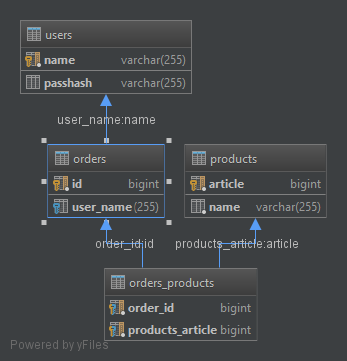

****Order REST API****

**Backend**
* Spring
* Hibernate

**DB**

* users ddl

`CREATE TABLE public.users (
  name CHARACTER VARYING(255) PRIMARY KEY NOT NULL,
  passhash CHARACTER VARYING(255)
);`

* products ddl 
 
 `CREATE TABLE public.products (
    article BIGINT PRIMARY KEY NOT NULL DEFAULT nextval('products_article_seq'::regclass),
    name CHARACTER VARYING(255) NOT NULL
  );`

* orders ddl

`CREATE TABLE public.orders (
  id BIGINT PRIMARY KEY NOT NULL DEFAULT nextval('orders_id_seq'::regclass),
  user_name CHARACTER VARYING(255),
  FOREIGN KEY (user_name) REFERENCES public.users (name)
  MATCH SIMPLE ON UPDATE NO ACTION ON DELETE NO ACTION
);`

* orders_products ddl

`CREATE TABLE public.orders_products (
   order_id BIGINT NOT NULL,
   products_article BIGINT NOT NULL,
   PRIMARY KEY (order_id, products_article),
   FOREIGN KEY (products_article) REFERENCES public.products (article)
   MATCH SIMPLE ON UPDATE NO ACTION ON DELETE NO ACTION,
   FOREIGN KEY (order_id) REFERENCES public.orders (id)
   MATCH SIMPLE ON UPDATE NO ACTION ON DELETE NO ACTION
 );`

**REST Interface**

Create order:

/order POST

`{"status":boolean,"orderId":long ,"message":String"}`

Get order:

/order/{orderId} GET

orderId: long

`{"id":long,"products":[{"article":long,"name":String},...]}`

Get orders:

/orders/{page}/{size} GET

page: int

size: int

`[{"id":long,"products":[{"article":long,"name":String},...],...]}`